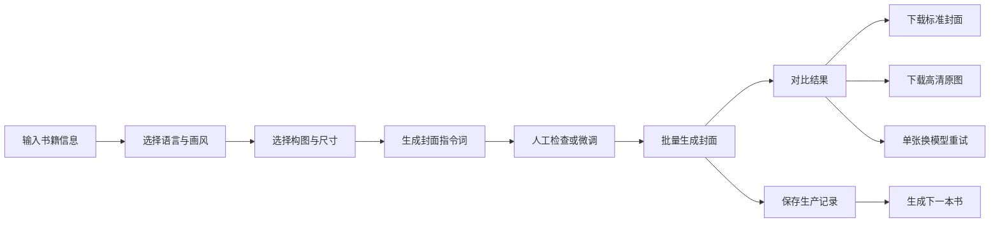
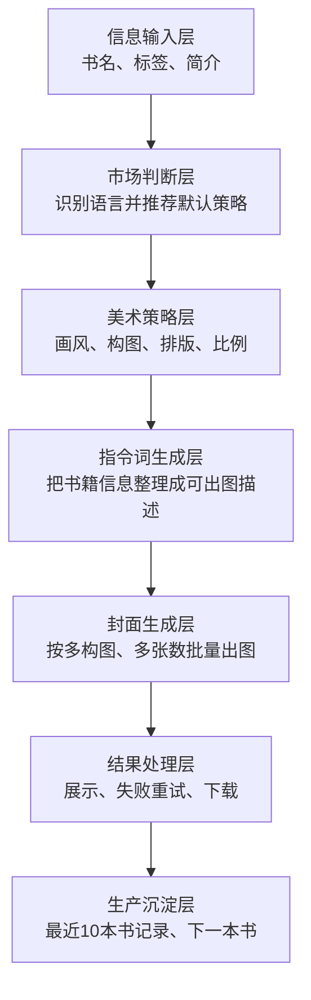
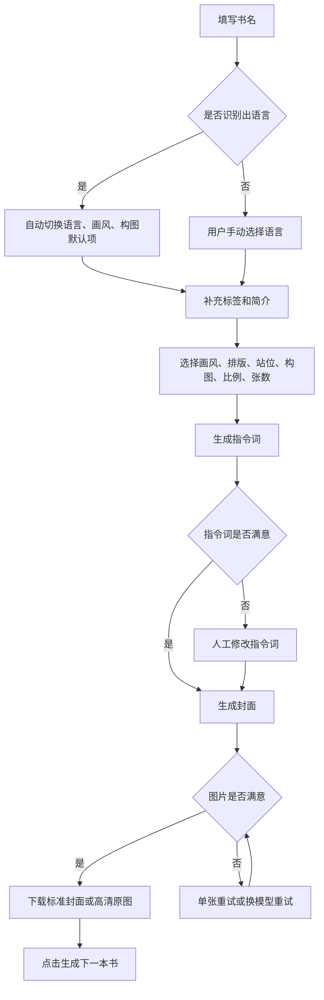
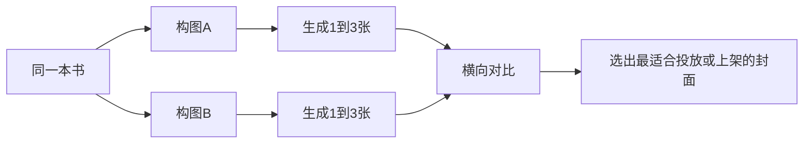
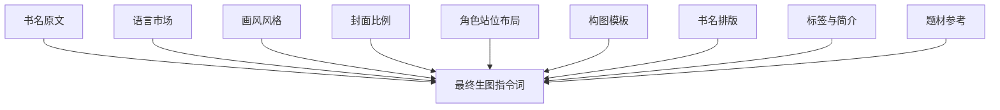
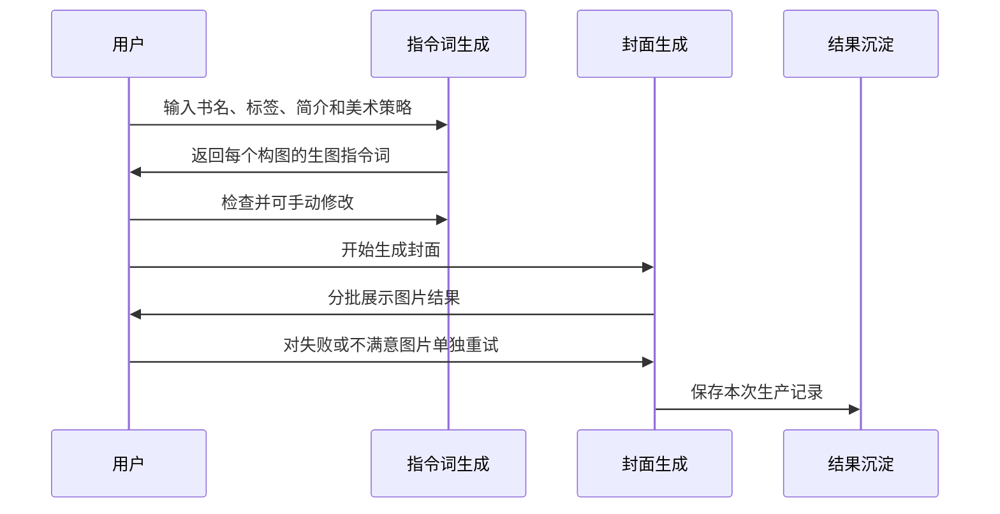

# 枫叶小说封面生成器产品说明文档

更新时间：2026-05-08  
适用对象：产品、运营、内容业务、封面生产负责人  
文档口径：以当前本地工具的实际功能为准，尽量使用业务语言说明，不展开研发实现细节。

## 一、产品定位

枫叶小说封面生成器是一款面向网文内容生产的封面批量辅助工具。它的目标不是替代专业设计师完成所有创意判断，而是把“理解书籍内容、生成封面方向、批量出图、挑选可用版本、沉淀生产记录”这条链路做得更快、更稳定。

产品适合三类场景：

| 场景 | 典型使用者 | 解决的问题 |
| --- | --- | --- |
| 新书快速包装 | 作者、编辑、运营 | 新书还没有封面时，快速获得可预览、可下载、可对比的封面方案 |
| 多语种内容运营 | 海外内容运营、翻译运营 | 不同语言市场的审美差异明显，需要自动推荐更合适的画风和构图 |
| 批量试图与选图 | 运营、投放、内容包装团队 | 同一本书需要多种构图、多张图对比，减少反复手工沟通 |

产品核心价值可以概括为四点：

| 价值 | 说明 |
| --- | --- |
| 提速 | 一次输入书名、标签和简介，即可生成多套封面方向 |
| 降低门槛 | 用户不需要懂设计术语，也能得到结构化的封面方案 |
| 适配市场 | 中文、英语、日语、西班牙语、葡萄牙语有不同默认审美策略 |
| 便于复盘 | 最近 10 本书的生产记录会自动保留，便于继续优化或复用 |

## 二、产品总览

当前工具是一页式工作台，左侧负责填写信息和选择策略，右侧负责查看指令词、生成图片、重试和下载。



产品由六个业务层组成：



## 三、核心功能清单

| 模块 | 功能 | 产品说明 |
| --- | --- | --- |
| 书籍信息 | 输入书名、标签、简介 | 书名是必填项；标签和简介越清晰，封面方向越贴近内容 |
| 语言选择 | 支持中文、英语、日语、西班牙语、葡萄牙语 | 输入书名时会自动判断语言，也支持人工切换 |
| 画风风格 | 根据语言展示不同画风 | 中文偏动漫视觉；海外语言默认偏真人视觉；日语默认偏唯美真人 |
| 书名排版 | 可选择书名在画面中的位置 | 支持自由发挥、顶部、底部、中央、左侧、右侧 |
| 角色站位布局 | 可选择人物站位和互动方式 | 支持模型自由发挥，也支持单人特写、双人对峙、背靠背、多人群像、孤独背影等布局 |
| 构图模板 | 可多选构图方向 | 一次可生成多个构图版本，便于横向对比 |
| 封面比例 | 支持竖图、方图、横图、宽屏、长竖屏 | 默认是小说封面常用的 3:4 竖图 |
| 指令词生成 | 为每个构图生成一条封面描述 | 用户可以直接编辑，用于控制画面 |
| 封面生成 | 按选中的构图和张数批量生成图片 | 默认每个构图生成 1 张，可调整为 2 张或 3 张 |
| 单张重试 | 某张失败或不满意时可单独重试 | 重试时可以为这一张单独切换生图模型 |
| 下载 | 支持标准封面和高清原图 | 标准封面适合上传使用，高清原图适合留档和二次处理 |
| 生产记录 | 自动保留最近 10 本书 | 可点击记录恢复书籍信息和指令词，继续生产 |
| 下一本书 | 生成完成后可一键清空 | 快速进入下一本书的生产流程 |

## 四、用户操作流程

### 1. 常规生产流程



### 2. 批量对比流程

同一本书通常不建议只生成一个方向。产品默认会推荐两个构图方向，让运营可以同时对比“人物吸引力”和“氛围/场景吸引力”。



## 五、默认策略说明

### 1. 语言识别策略

工具会根据书名自动判断语言，判断后会自动切换推荐画风和构图。

| 书名特征 | 默认判断 |
| --- | --- |
| 包含日文假名 | 日语 |
| 包含中文汉字 | 中文 |
| 包含明显英文高频词 | 英语 |
| 包含西班牙语常见词或特殊符号 | 西班牙语 |
| 包含葡萄牙语常见词或特殊字母 | 葡萄牙语 |
| 判断不明显 | 用户可手动选择 |

产品意义：减少用户配置成本，让封面从第一步就更贴近目标市场审美。

### 2. 画风默认策略

| 语言 | 可选画风 | 默认画风 | 运营理解 |
| --- | --- | --- | --- |
| 中文 | 3DCG动漫、二次元手绘 | 3DCG动漫 | 更贴近中文网文常见视觉包装，强调华丽、强冲击、题材感 |
| 英语 | 真人写实、美漫 | 真人写实 | 更贴近欧美小说封面和短剧海报审美，突出真人吸引力 |
| 西班牙语 | 真人写实、美漫 | 真人写实 | 更强调人物魅力、情绪张力和热烈关系感 |
| 葡萄牙语 | 真人写实、美漫 | 真人写实 | 与拉美及欧美向内容审美保持一致 |
| 日语 | 真人唯美、二次元手绘 | 真人唯美 | 默认更小清新、唯美、通透，避免过重、过暗、过硬 |

### 3. 构图默认策略

| 语言 | 默认构图 | 策略意图 |
| --- | --- | --- |
| 中文 | 角色特写、宏大场景 | 兼顾主角吸引力和世界观冲击力 |
| 英语 | 角色特写、中景氛围感 | 强化人物情绪和暧昧关系，更适合欧美读者点击 |
| 西班牙语 | 角色特写、中景氛围感 | 强调人物张力、热烈关系和电影感 |
| 葡萄牙语 | 角色特写、中景氛围感 | 强调人物吸引力和情绪表达 |
| 日语 | 中景氛围感、纯景无人 | 突出唯美、清透、空气感；减少过强的人物压迫感 |

说明：日语界面中的“纯景无人”对应的是日语专属的风景策略。它不是普通大场景，而是明确要求不出现任何人物。

### 4. 单模板张数策略

默认每个构图生成 1 张。  
用户可以选择每个构图生成 2 张或 3 张，用于获得更多备选图。

推荐用法：

| 任务 | 建议张数 |
| --- | --- |
| 快速预览方向 | 每个构图 1 张 |
| 运营正式选图 | 每个构图 2 张 |
| 重点书、投放书、爆款候选 | 每个构图 3 张 |

## 六、构图策略详解

### 1. 角色特写

角色特写适合强主角、强人设、强情绪的作品。它会把人物放在画面中心，重点突出脸、眼神、服饰、光效和情绪。

适合：

| 适合题材 | 说明 |
| --- | --- |
| 言情、都市、重生、快穿 | 通过人物颜值和情绪提高点击率 |
| 玄幻、修仙、武侠 | 用角色气场表达主角成长和战力 |
| 英语、西语、葡语内容 | 更容易突出人物魅力和关系张力 |

运营判断标准：

- 第一眼能看到主角。
- 人物表情或姿态有故事感。
- 背景不喧宾夺主。
- 书名有清晰承载区域。

### 2. 中景氛围感

中景氛围感是最通用的构图。它不会只看人物，也不会只看环境，而是让人物和故事场景同时成立。

适合：

| 适合题材 | 说明 |
| --- | --- |
| 大多数网文品类 | 兼容性最高，不容易跑偏 |
| 日语内容 | 更容易做出清新、含蓄、唯美的感觉 |
| 需要讲故事的封面 | 既有人物也有环境线索 |

运营判断标准：

- 能看出故事发生在哪里。
- 人物与环境有关系，不是硬贴上去。
- 画面层次清楚，有前后空间。
- 氛围能呼应书名和简介。

### 3. 宏大场景

宏大场景适合世界观强、题材感强的作品。它会强调空间、建筑、地貌、天象、光影和史诗感。

适合：

| 适合题材 | 说明 |
| --- | --- |
| 玄幻、修仙、洪荒 | 用巨大世界观提升作品质感 |
| 科幻、末日、历史 | 用空间和场面表达题材卖点 |
| 男频强设定作品 | 有利于表达升级、冒险、对抗 |

运营判断标准：

- 场景足够壮观，但不杂乱。
- 能明确感受到题材类别。
- 画面有纵深和光影重点。
- 书名不会被复杂背景吞掉。

### 4. 日语专属：纯景无人

日语下的“纯景无人”是一套单独策略，不是普通宏大场景。它要求画面完全不出现人物，包括正脸、背影、剪影、人群、手部、路人或人物雕像。

适合：

| 适合题材 | 说明 |
| --- | --- |
| 日语唯美、青春、治愈、轻小说感内容 | 用景色承载情绪，避免人物风格过重 |
| 需要小清新氛围的书 | 用天空、街道、庭院、海边、樱花、灯光等元素表达故事 |

运营判断标准：

- 没有任何人物。
- 画面清透、干净、柔和。
- 风景本身能表达情绪。
- 书名区域清晰，不被景物遮挡。

## 七、生图指令词策略与生产模板

生图指令词是连接“书籍信息”和“封面图片”的关键中间层。它不是给用户看的宣传文案，而是把书名、题材、画风、构图、排版和市场审美整理成一段明确的出图要求。

### 1. 为什么要先生成指令词

工具没有直接把书名和简介交给图片模型，而是先生成一段完整的封面描述，再让用户确认后出图。这样做有三个产品价值：

| 价值 | 说明 |
| --- | --- |
| 可控 | 用户能看见封面方向，发现不对可以先改指令词 |
| 可复用 | 同一本书的好指令词可以保留下来继续出图 |
| 可运营 | 运营可以把优秀封面方向沉淀成经验，而不是只看最终图片 |

### 2. 指令词的组成

每条生图指令词由九类信息拼成：



| 指令词组成 | 作用 |
| --- | --- |
| 书名原文 | 保证图片中要渲染的文字和用户输入一致 |
| 语言市场 | 决定人物面孔、审美、氛围方向 |
| 画风风格 | 决定真人、动漫、美漫、日系手绘等视觉表达 |
| 封面比例 | 决定图片横竖和封面排版空间 |
| 角色站位布局 | 决定人物数量、距离、关系和互动方式 |
| 构图模板 | 决定人物、场景和视角的组织方式 |
| 书名排版 | 决定书名出现在顶部、底部、中央或左右侧 |
| 标签与简介 | 帮助画面贴近故事设定 |
| 题材参考 | 为不同小说类型提供稳定的视觉元素 |

### 3. 书名文字策略

书名是当前工具最强的约束之一。用户输入的完整书名必须原样出现在生图指令词中。

例如用户输入：

```text
The Ice is Cold, But My Revenge is Colder
```

那么指令词中必须出现完整句子：

```text
The Ice is Cold, But My Revenge is Colder
```

不能翻译、不能缩写、不能拆开、不能改写。

当前书名文字规则：

| 规则 | 说明 |
| --- | --- |
| 必须原样出现 | 用户输入什么书名，指令词就必须包含什么书名 |
| 只允许出现书名 | 封面中不能出现作者名、副标题、宣传语等额外文字 |
| 不能出现干扰文字 | 不能出现数字编号、标志、水印、乱码、拼音、翻译文字、背景装饰文字 |
| 需要直接渲染 | 画面中应直接出现书名，而不是留空等待后期添加 |
| 排版可控 | 用户可以指定顶部、底部、中央、左侧、右侧或自由发挥 |

标准书名约束文案为：

```text
画面中必须清晰渲染唯一文字"书名原文"，最终封面除"书名原文"外，不得出现作者名、副标题、宣传语、数字编号、Logo、水印、乱码、拼音、翻译文字、其他语言文字、标牌文字、屏幕文字或任何背景装饰文字。
```

运营提示：如果图片里书名错字、漏字、乱码或出现多余文字，应直接判为不可用图。

### 4. 书名排版策略

| 排版选项 | 画面要求 | 适合场景 |
| --- | --- | --- |
| 默认自由发挥 | 根据画面自动选择合适位置 | 不确定哪种排版更好时 |
| 顶部居中 | 上方留出干净区域 | 常规小说封面、人物在中下方 |
| 底部排版 | 下方留出干净区域 | 人物脸部或天空在上方时 |
| 正中央大字 | 书名成为视觉核心 | 标题本身强卖点、概念感强 |
| 左侧对齐 | 左侧形成文字承载区 | 人物或场景重心偏右时 |
| 右侧对齐 | 右侧形成文字承载区 | 人物或场景重心偏左时 |

所有排版策略都会要求画面提供可读文字区域，避免书名压在过于复杂的背景上。

### 5. 角色站位布局策略

为了减少同类题材封面的站位重复，工具新增了“角色站位布局”参数。它和“构图模板”不是同一个概念：

- 构图模板决定镜头是特写、中景还是场景型。
- 角色站位布局决定人物是单人、双人对峙、背靠背、群像，还是孤独背影。

当前可选布局包括：

| 布局 | 适合方向 | 运营理解 |
| --- | --- | --- |
| 默认自由发挥 | 常规使用 | 由模型根据剧情自行决定，但会尽量避免固定恋爱海报套路 |
| 单人主角特写 | 复仇、黑化、成长、觉醒 | 强调核心角色的气场和情绪冲击 |
| 单人半身氛围 | 悲剧、治愈、悬疑、青春 | 人物与环境一起承载情绪 |
| 双人对峙张力 | 复仇、权力、误会、危险合作 | 重点不是甜蜜，而是博弈和冲突 |
| 双人错位互动 | 复杂关系、拉扯感、暧昧未明 | 保留关系感，但避免脸贴脸重复站位 |
| 背靠背关系 | 同盟、裂痕、宿命感 | 更适合表现复杂关系而不是热恋 |
| 权力压制关系 | 财阀、豪门、黑帮、狼人、强弱关系 | 强调上位与压迫感 |
| 多人群像关系 | 宫斗、家族、团队、副本、阵营 | 用多人物关系提升信息量 |
| 孤独远景 / 背影 | 悲剧、治愈、宿命、纯氛围 | 用空间和景物表达情绪 |

### 6. 语言市场策略

不同语言不是只翻译书名，而是会改变封面的审美方向。

| 语言 | 人物与审美策略 |
| --- | --- |
| 中文 | 如果有人物，偏东方/亚洲审美；封面可以更华丽、更题材化 |
| 英语 | 如果有人物，偏欧美真人审美；强调高颜值、情绪张力和电影海报感 |
| 西班牙语 | 如果有人物，偏拉美/西方审美；强调热烈、性感、强互动 |
| 葡萄牙语 | 与西班牙语接近，偏拉美/西方审美和强情绪表达 |
| 日语 | 偏日系审美，强调小清新、唯美、通透、轻盈，避免厚重压抑 |

特别说明：

- 英语、西班牙语、葡萄牙语默认不走亚洲人物审美。
- 日语如果选择“真人唯美”，会强化真人摄影感，避免变成二次元脸或虚拟感。
- 日语如果选择“二次元手绘”，会强化更平面、更纯正的日漫 2D 感。
- 英语、西班牙语、葡萄牙语不再默认把“高张力关系”直接等同于“快接吻站位”；会优先参考剧情主题和角色布局。

### 7. 画风策略

| 画风 | 指令词重点 | 避免方向 |
| --- | --- | --- |
| 3DCG动漫 | 立体、华丽、光效、精致材质、动漫角色质感 | 纯真人照片 |
| 二次元手绘 | 日系 2D、平面化、线条干净、色彩清透、赛璐璐感 | 真人、3D建模感、厚重厚涂 |
| 真人写实 | 真人摄影感、电影光影、真实材质、强画面冲击 | 动漫、插画感 |
| 真人唯美 | 真人轻写实、柔和梦幻、清新通透、日剧或写真集质感 | 二次元脸、娃娃脸、虚拟偶像感 |
| 美漫 | 硬朗线条、强对比、高饱和、分镜张力 | 日漫轻薄感、真人照片感 |

### 8. 题材风格策略

工具会根据标签和简介，为不同小说题材匹配常见视觉元素。

| 题材 | 常用视觉元素 |
| --- | --- |
| 玄幻 | 神秘遗迹、浮空岛、能量漩涡、符文、法阵 |
| 修仙 | 仙山、云雾、仙宫、灵树、瀑布、仙气 |
| 都市 | 高楼、霓虹、车流、玻璃幕墙、现代夜景 |
| 科幻 | 未来城市、太空站、机械结构、全息光效 |
| 武侠 | 竹林、山崖、古镇、明月、细雨、剑气 |
| 言情 | 花海、海边、花瓣、柔光、浪漫建筑 |
| 悬疑 | 废弃建筑、雾气、阴影、神秘符号 |
| 历史 | 宫殿、城墙、旗帜、兵器、庄重史诗感 |
| 规则怪谈 | 日常场景中的异常细节、规则告示、违和阴影 |
| 末日生存 | 废土、废墟、灰烬、昏黄天空、荒凉感 |
| 灵异 | 古宅、废弃医院、鬼火、雾气、阴森感 |
| 重生 | 时钟、沙漏、时空裂缝、古今交融 |
| 无限流 | 多副本世界、传送门、任务面板、游戏化空间 |
| 快穿 | 平行世界、时空隧道、任务卡片、多彩梦幻感 |
| 洪荒 | 原始大地、神山、混沌气流、先天灵宝 |

运营使用建议：标签不要只写“好看”“爽文”，应尽量写题材和卖点，例如“都市、复仇、豪门、强强关系”。

### 9. 剧情优先策略

新增原则：角色互动必须服从剧情，不允许所有海外题材都收敛成同一种暧昧双人图。

例如：

| 剧情类型 | 应优先出现的画面 |
| --- | --- |
| 复仇 / 背叛 / 反击 | 女主或主角的单人冲击特写、双人对峙、压制关系图 |
| 悲剧 / 失去 / 宿命 | 单人孤影、远景背影、低温氛围底图、疏离关系图 |
| 悬疑 / 危险 / 秘密 | 错位站位、遮挡、回头、监视感、双人博弈 |
| 纯 Romance / 热恋 | 才适合更近距离的关系图，但仍不建议所有图都做成快接吻姿态 |

产品意义：提高不同题材的封面差异化，减少用户对同类海报的审美疲劳。

### 10. 美学控制策略

无论选择哪种语言和画风，工具都会统一强调以下方向：

| 原则 | 说明 |
| --- | --- |
| 画面聚焦 | 不要堆太多元素，核心主体要明确 |
| 电影海报感 | 光影、质感、层次要像正式封面，而不是随手插图 |
| 强故事感 | 画面要能呼应书名和简介，让人产生阅读兴趣 |
| 文字可读 | 书名必须清晰，不能被人物、光效或背景遮挡 |
| 不留后期空白 | 图片生成时就要考虑书名承载区域 |

### 9. 生图指令词模板与拼装规则

这一部分是整套产品最重要的规则。它决定“输入什么，就会得到什么样的封面方向”。

### 1. 指令词的真实组成顺序

每一条指令词，实际都会按下面的顺序拼装：

1. 封面比例开头。
2. 画风要求。
3. 书名文字强约束。
4. 语言市场与人物审美要求。
5. 题材风格参考。
6. 构图模板要求。
7. 排版位置要求。
8. 书名唯一性要求。
9. 极简、电影海报感、强故事感等统一美学要求。

产品可以理解成“先定骨架，再补题材，再钉死书名，再补审美方向”。

### 2. 四类核心拼装模块

| 模块 | 作用 | 什么时候生效 |
| --- | --- | --- |
| 比例模块 | 决定图片是竖、横、方还是长竖 | 所有封面都生效 |
| 画风模块 | 决定是动漫、真人、唯美真人还是美漫 | 所有封面都生效 |
| 场景模块 | 决定题材元素和氛围 | 根据标签、简介和构图生效 |
| 文字模块 | 决定书名如何出现在画面里 | 所有封面都生效 |

### 3. 各场景怎么匹配

系统不是随便堆词，而是按“语言 + 画风 + 构图 + 题材”一起判断。

| 组合 | 场景策略 |
| --- | --- |
| 中文 + 3DCG动漫 + 角色特写 | 强主角、强服饰、强光效、强冲击 |
| 中文 + 3DCG动漫 + 宏大场景 | 世界观、神秘遗迹、修炼圣地、壮阔空间 |
| 英语 + 真人写实 + 角色特写 | 欧美真人审美、强人物魅力、情绪张力 |
| 英语 + 真人写实 + 中景氛围感 | 关系感更强，适合 romance / revenge / drama |
| 西班牙语 + 真人写实 + 角色特写 | 热烈、暧昧、情绪浓度更高 |
| 葡萄牙语 + 真人写实 + 中景氛围感 | 人物与环境并重，便于做通用海外封面 |
| 日语 + 真人唯美 + 中景氛围感 | 清新、唯美、通透，更像日剧或写真 |
| 日语 + 真人唯美 + 纯景无人 | 只保留景色，用风景表达情绪 |
| 日语 + 二次元手绘 + 中景氛围感 | 更平面、更日漫、更轻盈 |

### 4. 题材到场景的对应规则

| 题材类别 | 重点场景写法 |
| --- | --- |
| 玄幻 / 修仙 / 洪荒 | 神山、浮空岛、法阵、灵气、遗迹、天象、史诗空间 |
| 都市 / 豪门 / 复仇 / 职场 | 高楼、夜景、霓虹、玻璃幕墙、豪宅、车流、强关系感 |
| 科幻 / 无限流 / 快穿 | 未来结构、传送门、副本拼接、全息光效、空间跳转 |
| 武侠 / 历史 | 山崖、古镇、宫殿、兵器、旌旗、明月、细雨 |
| 言情 / Romance / Dark Romance | 近距离人物关系、暧昧互动、柔光、花瓣、雪夜、拥抱、凝视 |
| 悬疑 / 灵异 / 规则怪谈 | 阴影、雾气、废弃场景、异常细节、压迫感、未知感 |
| 末日生存 | 废墟、灰烬、残破城市、荒凉天空、强末世感 |
| 日语纯景 | 樱花、街道、海边、庭院、天空、灯光、季节感，无人物 |

### 5. 画风细则

| 画风 | 必须强调 | 必须避免 |
| --- | --- | --- |
| 3DCG动漫 | 立体、华丽、光效、动漫质感 | 纯真人照片感 |
| 二次元手绘 | 平面、日漫、线条干净、色彩清透 | 3D建模、厚涂、真人感 |
| 真人写实 | 真实人物、电影质感、真实材质 | 二次元、插画感 |
| 真人唯美 | 清新、通透、梦幻、真人写真感 | 二次元脸、娃娃脸、虚拟感 |
| 美漫 | 硬朗、浓烈、高对比、分镜感 | 轻薄日漫感、照片感 |

### 6. 书名与排版的硬规则

| 规则 | 说明 |
| --- | --- |
| 书名必须完整出现 | 输入什么，指令词就必须完整包含什么 |
| 只能有书名 | 不能出现作者名、副标题、宣传语、编号、Logo、水印等 |
| 书名要可读 | 画面中要有实际可承载书名的位置 |
| 不依赖后期 | 不能先留空，等后面再补字 |
| 书名位置可控 | 可放顶部、底部、中央、左侧、右侧或自由发挥 |

### 7. 真实可用的指令词片段

以下是当前产品里实际会用到的核心表达方式，便于产品和运营理解。

#### 7.1 封面比例

| 比例 | 开头表达 |
| --- | --- |
| 3:4 | 竖版构图，3:4比例，竖向书籍封面布局 |
| 1:1 | 正方形构图，1:1比例 |
| 4:3 | 横版构图，4:3比例 |
| 16:9 | 宽屏构图，16:9比例，影视感横向布局 |
| 9:16 | 长竖版构图，9:16比例，手机全屏布局 |

#### 7.2 角色特写

核心描述方向：

- 近景特写。
- 角色占画面中心大面积。
- 面容精致，眼神有故事感。
- 服饰精美，材质细腻。
- 背景虚化，但能看出题材轮廓。
- 侧光或斜上方光线，形成明暗层次。

#### 7.3 中景氛围感

核心描述方向：

- 人物和环境同时成立。
- 有半身像、剪影或人物存在感。
- 背景保留一定细节，不完全虚化。
- 氛围柔和或戏剧化。
- 前景、中景、远景有层次。

#### 7.4 宏大场景

核心描述方向：

- 广角或鸟瞰。
- 场景震撼、空间感强。
- 建筑、地貌、天空要有层次。
- 前景可以有道具或装饰增强深度。
- 适合史诗、世界观、冒险类内容。

#### 7.5 日语纯景无人

核心描述方向：

- 绝对无人。
- 只保留风景、城市远景或季节氛围。
- 颜色清透、柔和、干净。
- 用景色表达情绪，不用人物表达情绪。

### 8. 书名文字最终约束

产品里书名约束不是可选项，而是强规则。

标准要求是：

```text
画面中必须清晰渲染唯一文字"书名原文"，最终封面除"书名原文"外，不得出现作者名、副标题、宣传语、数字编号、Logo、水印、乱码、拼音、翻译文字、其他语言文字、标牌文字、屏幕文字或任何背景装饰文字。
```

如果运营发现图里多出其他文字，默认就是不合格图，不建议继续使用。

#### 9.1 指令词生成：System Prompt

用途：让文本模型扮演“小说封面设计师 + AI 绘图提示词专家”，把书名、标签、简介、语言市场、画风、构图和排版要求，整理成最终给生图模型使用的中文封面指令词。

变量：

| 变量 | 含义 |
| --- | --- |
| `{{ratioPrefix}}` | 封面比例前缀，例如“竖版构图，3:4比例，竖向书籍封面布局” |
| `{{styleConstraint}}` | 画风要求，根据用户选择的画风动态替换 |
| `{{title}}` | 用户输入的完整书名，必须原样保留 |
| `{{textConstraint}}` | 书名文字渲染与唯一文字要求 |
| `{{audienceConstraint}}` | 语言市场和人物审美要求 |
| `{{extraConstraint}}` | 特定语言的补充氛围要求，例如英语/西语/葡语的关系张力、日语的小清新唯美 |
| `{{genreStyleGuide}}` | 内置题材风格参考 |
| `{{composition}}` | 用户选择的构图名称 |
| `{{compositionTemplate}}` | 用户选择的构图模板，日语纯景无人会走专属模板 |

生产模板：

```text
你是一位专业的小说封面设计师和 AI 绘图提示词专家。你的任务是根据小说的信息，生成高质量的封面图片生成提示词。

**重要约束**：
1. **比例要求**：必须在提示词开头添加固定前缀："{{ratioPrefix}}"
{{styleConstraint}}
{{textConstraint}}
{{audienceConstraint}}{{extraConstraint}}

{{genreStyleGuide}}

**美学与排版核心原则 (CRITICAL)**：
- **极简高级聚焦**：画面元素绝对不能太杂乱，必须高度聚焦于核心主体，做到“少即是多”。背景要烘托氛围而非喧宾夺主。
- **电影海报级质感**：必须强调【大片级的电影宣传海报质感】（Cinematic movie poster, premium texture, photorealistic if applicable），极具视觉冲击力和高级审美。
- **强故事感与书名呼应**：画面氛围必须具有强烈的叙事感，且必须和【书名】高度相关。让人第一眼看到封面，就能产生关于故事的丰富联想。

**输出要求**：
- 直接输出完整的提示词，不要有任何前缀说明或解释
- 提示词必须以"{{ratioPrefix}}"开头
- 提示词长度控制在 300-500 字之间
- 结合小说的标题、简介、风格，生成个性化的视觉描述
- 必须严格遵循用户给定的【构图模板】要求，将视角、光影、人物特征等细节融入描述
- 必须在最终提示词中原样写入完整书名字符串"{{title}}"，并说明它的艺术化渲染方式；最终画面除"{{title}}"外不能出现任何其他文字
- 强调画面质感：8K高分辨率，极致细节刻画，电影级质感
```

#### 9.2 指令词生成：User Prompt

用途：把用户在页面上输入和选择的信息，明确交给文本模型，并再次强调构图模板和书名文字要求。

变量：

| 变量 | 当前规则 |
| --- | --- |
| `{{title}}` | 必填，未填写时不允许生成指令词 |
| `{{tags}}` | 用户填写的标签/风格；为空时填“无” |
| `{{summary}}` | 用户填写的简介概要；为空时填“暂无简介” |
| `{{composition}}` | 当前正在生成的构图名称 |
| `{{compositionTemplate}}` | 当前构图对应的详细模板 |

生产模板：

```text
请为以下小说生成封面图片的提示词：

【小说基本信息】
**小说标题**：{{title}}
**书籍标签/风格**：{{tags}}
**小说简介**：{{summary}}

【强制构图要求：{{composition}}】
请你务必在生成的画面描述中，严格落实以下构图模板的每一个细节（包括构图视角、人物刻画、背景处理、光线、特效和层次）：
{{compositionTemplate}}

请根据以上信息，深度结合小说背景与【强制构图要求】，生成一个高质量的封面图片提示词。必须让生图模型画出符合该构图模板的画面！

【书名文字强制要求】
最终提示词必须包含对书名文字"{{title}}"的清晰渲染描述，画面中只能出现"{{title}}"，不能出现任何其他文字、数字、Logo、水印、标牌、屏幕文字或装饰性文字。
```

#### 9.3 画风要求 Prompt 片段

这段会根据用户选择的画风动态替换到 System Prompt 中。

| 画风 | Prompt 片段 |
| --- | --- |
| 真人写实 | `2. **画风要求**：强制使用极具真实感的【真人写实画风】，注重电影级光影层次、真实材质和画面冲击力，绝对禁止二次元或插画感。` |
| 美漫 | `2. **画风要求**：强制使用经典的【美式漫画风格 (American Comic Style)】，强调硬朗的墨线勾勒、浓烈的色彩、高对比度和极具张力的分镜构图。` |
| 真人唯美 | `2. **画风要求**：强制使用极具质感的【真人轻写实唯美画风】，人物必须是真人摄影/轻写实质感，五官、皮肤、发丝、衣料和环境材质都要接近真实摄影与电影海报审美；注重柔和梦幻的氛围光影、清新通透的空气感、细腻干净的色彩和极致审美感。绝对禁止二次元、动漫、漫画、赛璐璐、插画、3D CG 建模脸或虚拟偶像质感。` |
| 二次元手绘 | `2. **画风要求**：强制使用高品质的【日系二次元手绘 2D 风格 (Anime Style)】，必须是更平面化、更纯正的日漫二次元插画效果，色彩清透轻盈，线条细腻干净，赛璐璐感明确，弱化体积建模和真实材质，绝对禁止 3D 渲染感、厚重厚涂感或真人质感。` |
| 3DCG动漫 | `2. **画风要求**：必须强调精致的【3D CG 动漫风格 (3D Anime CG)】，富有立体感、细腻的渲染材质和华丽的光效，禁止纯真人风格。` |

#### 9.4 书名文字 Prompt 片段

这段是所有语言、所有画风、所有构图都会生效的硬约束。

```text
3. **书名文字渲染硬约束 (CRITICAL)**：最终生图指令词必须原样包含完整书名字符串"{{title}}"，不能省略、翻译、改写或拆开。必须明确要求画面中直接渲染书名文字"{{title}}"，{{layoutRule}}使用创意书法变形字体，大气磅礴，笔画带有光效，且与画面主体呼应。{{blankRule}}
4. **唯一文字硬约束 (CRITICAL)**：最终封面中唯一允许出现的可读文字只能是书名"{{title}}"。绝对禁止作者名、副标题、宣传语、数字编号、Logo、水印、乱码、拼音、翻译文字、其他语言文字、标牌文字、屏幕文字、书脊文字、背景装饰文字或任何非书名干扰文字。
7. **最高文字防篡改指令 (CRITICAL)**：书名必须严格保留原文：【{{title}}】。绝对不可将其翻译、改写、拆字、增字或漏字！
```

排版变量：

| 排版选择 | `{{layoutRule}}` | `{{blankRule}}` |
| --- | --- | --- |
| 顶部居中 | 要求书名排版在画面正上方 | 画面正上方形成充足的纯净文字承载区 |
| 底部排版 | 要求书名排版在画面正下方 | 画面正下方形成纯净文字承载区 |
| 正中央大字 | 要求书名作为核心视觉焦点排版在画面正中央 | 画面正中央形成稳定视觉中心，确保书名清晰可读 |
| 左侧对齐 | 要求书名靠画面左侧对齐排版 | 画面左侧形成纯净文字承载区 |
| 右侧对齐 | 要求书名靠画面右侧对齐排版 | 画面右侧形成纯净文字承载区 |
| 默认自由发挥 | 排版位置由你自由发挥 | 画面提供合适的文字承载区域 |

如果文本模型返回的指令词没有包含完整书名，或没有强调“唯一文字/不得出现其他文字”，工具会自动在末尾补上一段兜底文案：

```text
画面中必须清晰渲染唯一文字"{{title}}"，最终封面除"{{title}}"外，不得出现作者名、副标题、宣传语、数字编号、Logo、水印、乱码、拼音、翻译文字、其他语言文字、标牌文字、屏幕文字或任何背景装饰文字。
```

#### 9.5 语言市场 Prompt 片段

这段会根据书名识别结果或用户选择的语言动态替换到 System Prompt 中。

| 语言 | Prompt 片段 |
| --- | --- |
| 中文 | `4. **受众与角色形象**：目标受众为中国读者，如果画面中出现人物，请确保其具有典型的【东方/亚洲人面孔】，符合中式审美，人物面容精致唯美。` |
| 英语 | `4. **受众与角色形象 (CRITICAL)**：目标受众为欧美读者。角色必须极其帅气漂亮：男主必须是【深邃英俊、下颌线清晰的白人男性 (Extremely handsome Caucasian male, sharp jawline)】，女主必须是【极致迷人、五官精致的白人女性 (Gorgeous Caucasian female)】，极具性吸引力，绝对不可出现亚洲面孔！` |
| 西班牙语/葡萄牙语 | `4. **受众与角色形象 (CRITICAL)**：目标受众为拉美及欧美读者。角色必须极其帅气漂亮：男主是【极具魅力的拉美/西方狂野男性 (Hot Latino/Western male, ruggedly handsome)】，女主是【性感火辣的拉美/西方女性 (Sensual Latino/Western female)】，极具性吸引力，绝对不可出现亚洲面孔！` |
| 日语 + 真人唯美 | `4. **受众与角色形象**：目标受众为日本读者。如果画面中包含人物，角色必须是【日系/亚洲真人面孔】和轻写实摄影质感，五官柔和清透，像真实日剧、写真集或电影海报中的人物；禁止二次元脸、动漫脸、插画脸、娃娃脸或 3D CG 建模脸。` |
| 日语 + 二次元手绘 | `4. **受众与角色形象**：目标受众为日本读者。如果画面中包含人物，角色必须符合【日系/亚洲面孔审美】，偏向典型的日漫二次元唯美特征，五官柔和清透。` |

语言补充氛围：

```text
英语：需要符合欧美小说封面和短剧海报审美，强调高颜值、电影质感和戏剧冲突；角色互动强度必须服从剧情，不再默认生成极近距离接吻式站位。

西班牙语/葡萄牙语：可以保留拉美及欧美市场偏爱的浓烈情绪和关系张力，但人物站位要服务剧情主轴，不再机械重复快接吻或甜蜜相拥姿态。

日语：强烈偏向小清新、唯美、通透、轻盈的日系审美，避免厚重、压抑、脏灰或过于硬朗的风格。
```

#### 9.6 构图模板：角色特写

```text
角色特写风格：
- 构图：近景特写，角色占据画面中心2/3区域，平视或轻微仰视视角
- 人物细节：面容精致，眼神深邃有神，服饰华丽精美，衣料质感细腻
- 背景：虚化处理，隐约可见题材相关元素轮廓
- 光线：主光源从侧面或斜上方照射，形成明暗对比
- 特效：人物周围环绕相应的粒子特效
- 层次：前景人物、中景特效、远景虚化背景
```

#### 9.7 构图模板：中景氛围感

```text
中景氛围感风格：
- 构图：平视或轻微俯仰视角，平衡人物与环境
- 场景：环境与人物相得益彰，既有人物剪影或半身像，又有环境细节
- 背景：不完全虚化，保留一定的环境细节
- 前景：适当的装饰或虚化元素，增强画面层次
- 光线：柔和或戏剧性的光线，形成和谐的明暗关系
- 层次：前景、中景人物、远景环境
```

#### 9.8 构图模板：宏大场景

```text
宏大场景风格：
- 构图：广角或鸟瞰视角，展现场景的震撼感和空间感
- 场景：环境宏大壮丽，建筑或地貌细节丰富，远近层次分明
- 背景：天空或背景呈现符合题材的色调和效果
- 前景：地面或前景有相关的道具或装饰，增强画面深度
- 光线：多光源混合或单一主光源，形成丰富的明暗层次
- 层次：前景、中景、远景分明
```

#### 9.9 日语专属构图模板：纯景无人

当语言为日语，并且用户选择“纯景无人”时，会替换普通“宏大场景”模板。

```text
日语唯美纯景色宏大场景风格：
- 构图：广角或远景视角，展现纯粹风景的空间感、层次感与诗意氛围
- 核心要求：画面必须是【无人纯景色】，绝对不要出现任何人物、背影、人影、脸、身体、路人、人群、剪影、手部或人物雕像
- 场景：以自然景色、城市远景、庭院、街道、海边、樱花、天空、云层、灯光、建筑或季节氛围作为主体
- 背景：干净通透，色彩柔和唯美，具有日系小清新空气感
- 前景：可以有花瓣、树枝、路灯、水面倒影、窗景、雨雪、纸伞或静物，但不能出现人物
- 光线：柔和自然光、清晨/黄昏/夜樱/月光等唯美光影，避免压抑厚重
- 层次：前景景物、中景环境、远景天空或建筑分明
```

#### 9.10 题材风格参考 Prompt

这段会被完整放进 System Prompt，供文本模型根据标签和简介选择视觉元素。

```text
题材风格参考（根据小说题材选择合适的视觉元素）：
- 玄幻：古风玄幻世界，修炼圣地或神秘遗迹，浮空岛屿，能量漩涡，发光符文和法阵，荧光粒子和能量光点，神秘壮观的氛围
- 修仙：仙侠意境，仙山福地，云雾缭绕的仙宫楼阁，仙鹤飞翔，灵树仙草，灵泉瀑布，清新淡雅的仙气氛围
- 都市：现代都市夜景，高楼大厦，霓虹灯光，玻璃幕墙反射，车流光轨，赛博朋克风格，时尚现代的氛围
- 科幻：未来科幻世界，太空站或未来城市，金属机械结构，悬浮飞行器，能量护盾，全息投影，科技粒子和数据流，冷峻未来的氛围
- 武侠：中国武侠意境，竹林山崖，古镇寺庙，明月细雨，剑气刀光，水墨画风格，古朴典雅的氛围
- 言情：唯美浪漫场景，花海或海边，梦幻建筑，飘落花瓣，柔和光点，温馨梦幻的氛围
- 悬疑：悬疑惊悚场景，废弃建筑，阴暗街道，雾气烟雾，神秘符号，压抑诡异的氛围
- 历史：历史史诗场景，古代宫殿城墙，雕梁画栋，旗帜飘扬，古代兵器战车，庄重威严的氛围
- 规则怪谈：日常场景中的诡异细节，规则告示，扭曲阴影，诡异违和的氛围
- 末日生存：末日废土场景，废弃城市废墟，残破建筑，昏黄天空，灰烬辐射，荒凉绝望的氛围
- 灵异：灵异恐怖场景，古老宅院或废弃医院，鬼火灵体，雾气弥漫，阴森恐怖的氛围
- 重生：重生穿越场景，古今交融，时空裂缝，能量波动，时钟沙漏，奇幻神秘的氛围
- 无限流：无限流副本场景，多个副本世界拼接，传送门，任务面板，游戏化元素，科幻游戏的氛围
- 快穿：快穿世界场景，多个平行世界交织，时空隧道，螺旋构图，任务卡片，梦幻多彩的氛围
- 洪荒：洪荒神话场景，原始洪荒大地，巨大神山，混沌气流，先天灵宝，原始壮阔的氛围
```

## 八、生成编排策略详解

这里的“编排”指的是工具如何安排一次生产任务：先做什么、同时做什么、失败后怎么补救、结果怎么沉淀。

### 1. 两段式生产



两段式的好处：

| 好处 | 说明 |
| --- | --- |
| 先看方向再出图 | 避免用户完全不知道系统会画什么 |
| 支持人工干预 | 运营可以直接修改不合适的描述 |
| 支持多构图复用 | 同一本书可以保留多条指令词，继续出图 |

### 2. 多构图并行策略

用户选择多个构图后，工具会为每个构图分别生成一条指令词。

例如选择：

- 角色特写
- 中景氛围感

则会得到两条不同指令词，而不是一条混合指令词。

产品意义：

| 策略 | 好处 |
| --- | --- |
| 一个构图一条指令词 | 避免人物特写和场景图互相干扰 |
| 每条指令词可单独编辑 | 运营可以只修改某个方向 |
| 图片按构图分组展示 | 方便判断哪个构图更适合该书 |

### 3. 多图生成策略

每个构图默认生成 1 张。用户提高张数后，会按照“构图数量 × 单模板张数”生成一组对比图。

示例：

| 构图数量 | 每个构图张数 | 总生成张数 |
| --- | --- | --- |
| 1 个 | 1 张 | 1 张 |
| 2 个 | 1 张 | 2 张 |
| 2 个 | 3 张 | 6 张 |
| 3 个 | 2 张 | 6 张 |

当前封面生成会按最多 3 张同时推进，以提高等待效率。若图片服务繁忙，部分图片可能失败，但不会影响其他图片继续返回。

### 4. 失败补救策略

封面生成可能因为供应商繁忙、排队时间过长、网络波动或图片服务返回异常而失败。工具当前有三层补救：

| 补救层级 | 说明 |
| --- | --- |
| 自动重试 | 单张图失败后会自动尝试最多 3 次 |
| 单张重试 | 失败卡片会保留，用户可以只重试这一张 |
| 换模型重试 | 单张重试前可以单独切换生图模型，不影响其他图 |

失败信息会展示在对应图片卡片上，也会保留更完整的排查信息，方便定位是超时、服务繁忙还是返回异常。

### 5. 等待时间策略

图片生成最长等待时间为 180 秒。  
如果超过这个时间仍未返回，工具会认为该张图片失败，并给用户展示失败提示。

运营建议：

| 情况 | 建议 |
| --- | --- |
| 单张超时 | 先点击单张重试 |
| 多张同时失败 | 可能是供应商繁忙，稍后再试 |
| 某个模型持续失败 | 临时切换到另一个生图模型 |
| 一直生成慢 | 减少单次总张数，优先保证关键构图 |

### 6. 模型选择策略

工具把模型分为两类：一类负责理解书籍并写指令词，一类负责根据指令词画封面。

| 类型 | 当前选项 | 默认 |
| --- | --- | --- |
| 指令词模型 | DeepSeek Flash、DeepSeek Pro Thinking、Claude Sonnet 4.5、Gemini 2.5 Pro、Gemini 3 Flash、GPT-5.5 | DeepSeek Flash |
| 封面生成模型 | GPT Image 2、Gemini Image 2K、Gemini Image 4K | GPT Image 2 |

运营建议：

| 目标 | 建议选择 |
| --- | --- |
| 快速批量生产 | 默认组合即可 |
| 指令词需要更深理解 | 可尝试 DeepSeek Pro Thinking |
| 单张图片失败 | 在失败卡片上换另一个封面生成模型重试 |
| 需要更大原图 | 可尝试 4K 图像模型 |

### 7. 下载策略

生成结果提供两种下载方式：

| 下载类型 | 用途 | 规格 |
| --- | --- | --- |
| 标准封面 | 适合上传平台、日常运营使用 | 3:4 时为 600×800，目标控制在 500KB 以内 |
| 高清原图 | 适合留档、后续精修、设计二次处理 | 保留生成结果原始清晰度 |

不同比例的标准封面尺寸：

| 比例 | 标准封面尺寸 |
| --- | --- |
| 3:4 | 600×800 |
| 1:1 | 800×800 |
| 4:3 | 800×600 |
| 16:9 | 960×540 |
| 9:16 | 540×960 |

### 8. 生产记录策略

工具会保留最近 10 本书的生产记录。

记录内容包括：

| 记录项 | 用途 |
| --- | --- |
| 书名 | 快速识别是哪本书 |
| 语言、画风、比例 | 复盘当时的市场和美术选择 |
| 标签、简介 | 保留生成依据 |
| 构图选择 | 复用当时的构图组合 |
| 指令词 | 后续继续出图或优化 |
| 图片结果 | 恢复当时生成出的封面卡片，便于继续看图、重试或对比 |
| 成功/失败数量 | 判断这次生产质量 |
| 生成时间 | 便于追踪最近生产批次 |

点击历史记录后，会恢复书籍信息、指令词和图片结果。这样运营可以直接看到当时产出的封面，不需要重新生成一遍。

## 九、不同语言的运营打法

### 1. 中文书

推荐默认组合：

| 项目 | 推荐 |
| --- | --- |
| 画风 | 3DCG动漫 |
| 构图 | 角色特写 + 宏大场景 |
| 适合方向 | 玄幻、修仙、都市、武侠、重生、无限流等 |

运营重点：

- 看题材感是否强。
- 看主角气场是否足。
- 看书名是否准确且醒目。
- 男频可多试宏大场景，女频可多试角色特写和中景氛围。

### 2. 英语书

推荐默认组合：

| 项目 | 推荐 |
| --- | --- |
| 画风 | 真人写实 |
| 构图 | 角色特写 + 中景氛围感 |
| 适合方向 | Romance、Revenge、Billionaire、Werewolf、Dark Romance 等 |

运营重点：

- 人物是否符合欧美审美。
- 男女主关系是否有张力。
- 书名英文是否完整准确。
- 画面是否像小说封面或短剧海报，而不是普通照片。

### 3. 西班牙语和葡萄牙语书

推荐默认组合：

| 项目 | 推荐 |
| --- | --- |
| 画风 | 真人写实 |
| 构图 | 角色特写 + 中景氛围感 |
| 适合方向 | Romance、Drama、Revenge、Mafia、CEO 等 |

运营重点：

- 人物要有热烈、直接的吸引力。
- 互动姿态可以更强，但不能显得廉价。
- 色彩和光影可以更浓烈。
- 书名必须保持原语言，不要出现翻译或乱码。

### 4. 日语书

推荐默认组合：

| 项目 | 推荐 |
| --- | --- |
| 画风 | 真人唯美 |
| 构图 | 中景氛围感 + 纯景无人 |
| 适合方向 | 青春、治愈、恋爱、悬疑氛围、轻小说感内容 |

运营重点：

- 默认不追求强烈厚重，而追求清新、唯美、通透。
- 选择真人唯美时，画面应该更像日剧、写真、电影海报。
- 选择二次元手绘时，画面应该更平面、更日漫，不要有 3D 建模感。
- “纯景无人”必须完全没有人物。

## 十、质量验收标准

### 1. 必过项

以下任一项不通过，建议直接淘汰该图：

| 检查项 | 通过标准 |
| --- | --- |
| 书名 | 书名完整、准确、没有错字漏字 |
| 唯一文字 | 除书名外，没有其他可读文字 |
| 语言 | 书名没有被翻译成其他语言 |
| 人物 | 人物面孔符合目标语言市场审美 |
| 构图 | 符合所选构图模板 |
| 画风 | 符合所选画风，没有明显跑偏 |
| 可读性 | 缩小后仍能看清书名和主体 |
| 完整度 | 没有明显残缺、畸形、错位、严重杂乱 |

### 2. 加分项

| 检查项 | 加分表现 |
| --- | --- |
| 点击吸引力 | 第一眼能产生兴趣 |
| 题材识别 | 不看简介也能大致判断题材 |
| 情绪表达 | 能传达复仇、浪漫、悬疑、热血等核心情绪 |
| 商业质感 | 像正式上架封面，而不是草稿 |
| 差异化 | 与同类书封面相比有记忆点 |

## 十一、常见问题与处理建议

| 问题 | 可能原因 | 建议 |
| --- | --- | --- |
| 书名错字或乱码 | 图片生成对文字不稳定 | 重新生成；必要时缩短书名或选择更清晰排版 |
| 出现作者名或多余文字 | 画面理解偏离约束 | 淘汰该图，或在指令词里再次强调只允许书名 |
| 日语真人变成二次元 | 画风约束不够稳定 | 确认选择“真人唯美”，并在指令词中强调真人摄影感 |
| 日语纯景出现人物 | 构图策略没有被充分遵守 | 直接重试，必要时在指令词开头强调“无人纯景色” |
| 英语封面出现亚洲脸 | 语言市场策略未被完全执行 | 重试或补充“欧美真人审美”相关描述 |
| 画面太乱 | 题材元素堆叠过多 | 删除部分标签，保留最核心卖点 |
| 生成太慢 | 供应商排队或图片复杂度高 | 减少单次张数，或稍后重试 |
| 多张失败 | 图片服务可能繁忙 | 换模型、单张重试，或隔一段时间再生成 |
| 下载图太大 | 原图清晰度高 | 使用“标准封面”下载 |

## 十二、运营使用建议

### 1. 输入信息建议

高质量输入示例：

```text
书名：The Ice is Cold, But My Revenge is Colder
标签：Revenge, Billionaire, Dark Romance, Snow, Betrayal
简介：女主被未婚夫和家族背叛后，在雪夜归来复仇，并与冷酷财阀男主形成危险暧昧的合作关系。
```

不建议输入：

```text
标签：好看、热门、爆款
简介：一个很好看的故事。
```

原因：后者没有提供人物、题材、场景和情绪线索，封面容易变得泛化。

### 2. 批量生产建议

| 任务类型 | 推荐流程 |
| --- | --- |
| 普通新书 | 默认设置生成 2 张，对比后下载 |
| 重点新书 | 两个构图，每个构图 2 到 3 张 |
| 海外 Romance | 优先角色特写和中景氛围感 |
| 中文男频强设定 | 保留宏大场景，强化世界观 |
| 日语唯美书 | 优先中景氛围感和纯景无人 |

### 3. 选图建议

运营选图时可以按以下顺序判断：

1. 书名是否正确。
2. 是否有多余文字。
3. 目标市场审美是否正确。
4. 缩略图是否有吸引力。
5. 是否能看出题材和情绪。
6. 是否适合当前投放或上架位置。

## 十三、后续优化方向

| 方向 | 产品价值 |
| --- | --- |
| 无字底图 + 后期自动排版 | 彻底解决书名错字、乱码、多余文字问题 |
| 运营模板库 | 将高转化题材沉淀成可复用模板 |
| 评分与收藏 | 让运营标记好图，形成内部审美样本 |
| 多平台尺寸包 | 一次生成封面、推荐位、横幅、投放图 |
| 题材专属策略 | 对 Romance、玄幻、狼人、CEO、复仇等热门题材做更细策略 |
| 失败原因分类 | 区分服务繁忙、超时、文字失败、画风跑偏等问题 |
| 团队共享记录 | 从单人浏览器记录升级为团队生产资产 |

## 十四、一句话总结

枫叶小说封面生成器的核心逻辑是：先根据书名、语言市场、题材和构图生成可检查的生图指令词，再批量生成多张封面供运营选择，并通过重试、换模型、标准下载和最近记录，让封面生产从“碰运气出图”变成“有策略、有对比、有沉淀”的工作流。
